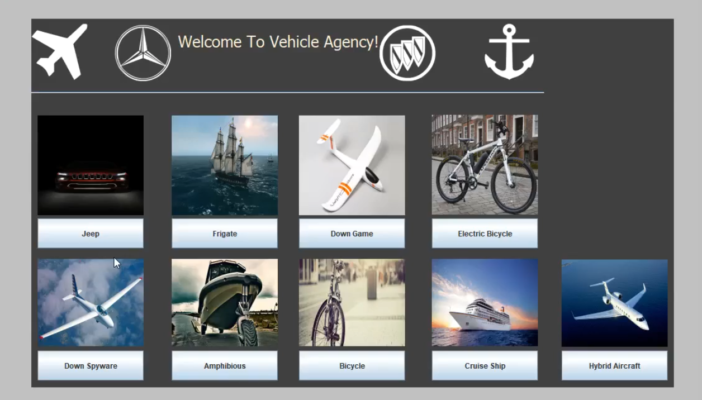

# Vehicle-Agency
Vehicle agency that holds a local database with various types of vehicles for selling. This project was developed with Java language and the Eclipse IDE.
Some of the principles were implemented in the project are Multithreading, Locks synchronization, Design Patterns , OOP and Interfaces. 

### Features
  * Add new vehice to the vehicles agency
  * Buy a vehicle
  * Take a vehicle to test drive
  * Change vehicle flag (for sea-vehicles)
  * Reset vehicle miles after test drive
  * Show all the existing vehicles in the agency
  * Save current state of vehicles in the agency (miles and flags)
  * Load previous state (the system can load only 3 last states)
  
### Design Patterns:
 * Singlethon
 * Deligator
 * Decorator
 * Observer
 * Memento
 * Abstract factory
 * Thread pool

### Prerequisites

To run this project you just need go to  Vehicles-Agency/src/Part-2/MainPage.java and run the main page of the project.

